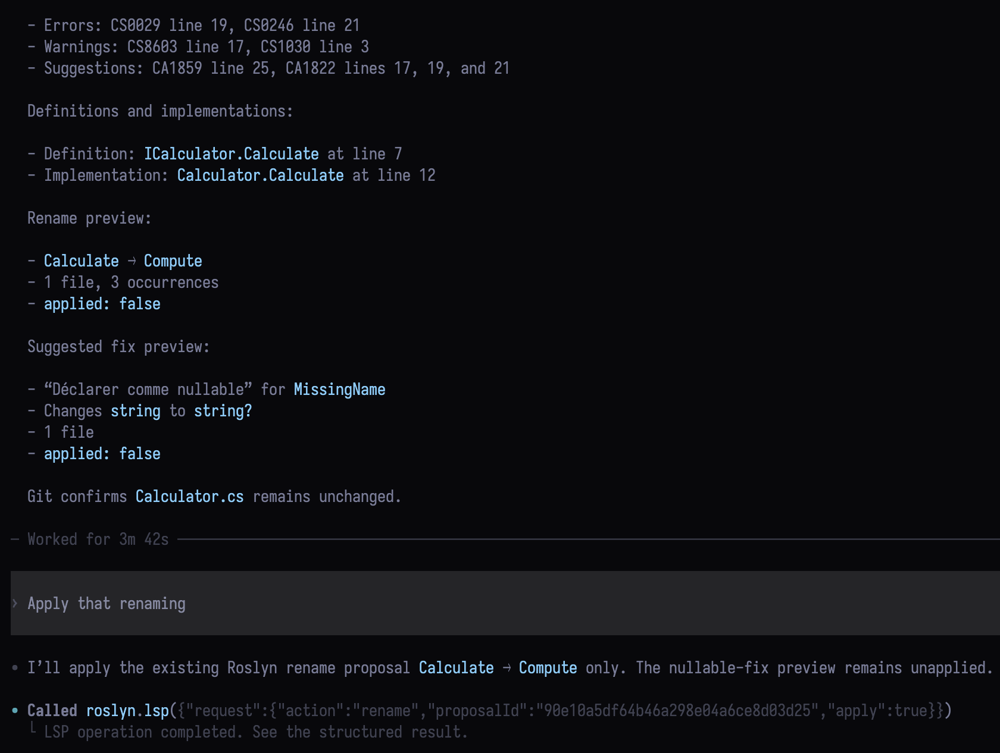

# Roslyn Codex LSP

C# diagnostics, navigation and refactoring in Codex, backed by the official Roslyn language server.
The bridge connects Codex through the Model Context Protocol (MCP). No editor extension is required.

- Read errors, warnings and analyzer suggestions.
- Find definitions, implementations, references and symbols.
- Preview and apply renames, fixes and refactorings.

[Get started](getting-started.md) to connect your project, or see [Usage](usage.md) for the tool reference.

The [agent reference](./llms/index.txt) provides plain-text API guides and JSON examples for diagnostics, navigation and edits.

## Example

Codex inspects diagnostics, previews a rename and a fix, then applies the selected rename.

